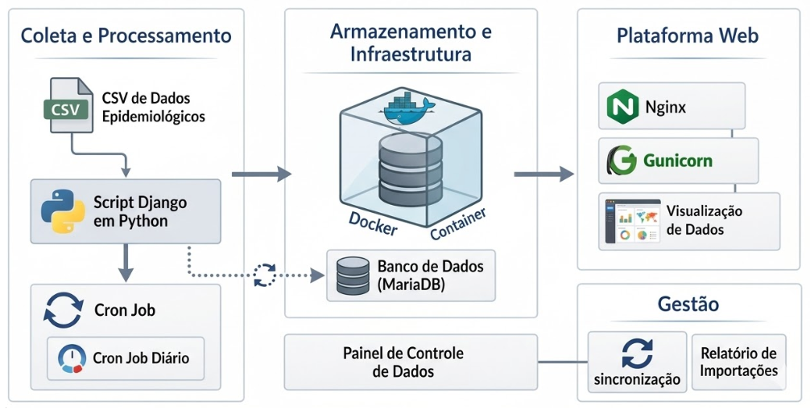

# VigiaSaúde

🌐 **Site:** [https://vigiasaude.com.br](https://vigiasaude.com.br)

VigiaSaúde é uma plataforma web para **monitoramento e visualização de dados epidemiológicos**, com foco inicial na **dengue**. O sistema coleta dados automaticamente através de um processo de ingestão periódica e os disponibiliza em uma interface web para consulta e análise.

O objetivo do projeto é demonstrar uma arquitetura completa de aplicação web em produção, incluindo **coleta automatizada de dados, armazenamento em banco relacional e deploy em servidor Linux**.

A coleta de dados do sistema é realizada por meio do download de um arquivo **CSV disponibilizado publicamente**, contendo os registros atualizados de casos de dengue. O comando de ingestão acessa esse link, baixa o arquivo e processa os dados utilizando bibliotecas de análise em Python, inserindo ou atualizando os registros no banco de dados.

Essa abordagem foi escolhida por ser **mais estável e previsível do que a coleta direta via API do SINAN**. A API oficial frequentemente apresenta limitações de acesso, instabilidade ou mudanças de estrutura que podem quebrar o processo de ingestão. Já o CSV é uma fonte de dados consolidada, com formato consistente e fácil de processar em lote, permitindo maior confiabilidade no pipeline de importação e reduzindo a complexidade da integração.

  

---

# Tecnologias Utilizadas

O projeto foi desenvolvido utilizando as seguintes tecnologias:

- **Python 3**
- **Django** – framework web principal
- **MariaDB / MySQL** – banco de dados relacional
- **Docker** – containerização do banco de dados
- **Gunicorn** – servidor WSGI para aplicações Python
- **Nginx** – servidor web e proxy reverso
- **Certbot** – geração automática de certificados HTTPS
- **Cron** – execução automática de tarefas agendadas

---

# Funcionalidades

- Importação automatizada de dados de dengue
- Armazenamento estruturado em banco de dados relacional
- API backend para consumo de informações
- Execução diária de tarefas de coleta de dados

---

# Arquitetura da Aplicação

A aplicação segue uma arquitetura comum para aplicações Django em produção:

Nginx → Gunicorn → Django → MariaDB

Nginx atua como proxy reverso, encaminhando requisições HTTP/HTTPS para o Gunicorn, que executa a aplicação Django. O banco de dados MariaDB roda em um container Docker.

# Deploy em Produção

O deploy foi realizado em um servidor Linux utilizando:

- Nginx como proxy reverso
- Gunicorn como servidor WSGI
- Certbot para configuração automática de HTTPS
- Docker para execução do banco MariaDB

Fluxo de requisição:

Cliente → Nginx → Gunicorn → Django → MariaDB

---

# Segurança

- HTTPS configurado via Certbot
- Proxy reverso com Nginx
- Separação de variáveis sensíveis via `.env`
- Banco de dados isolado em container Docker

---

# Possíveis Melhorias Futuras

- Dashboard interativo para visualização de dados
- API pública para consulta de estatísticas
- Visualização geográfica dos dados
- Integração com outras fontes epidemiológicas

---

# Licença

Este projeto foi desenvolvido para fins educacionais e de demonstração de arquitetura de aplicações web.
